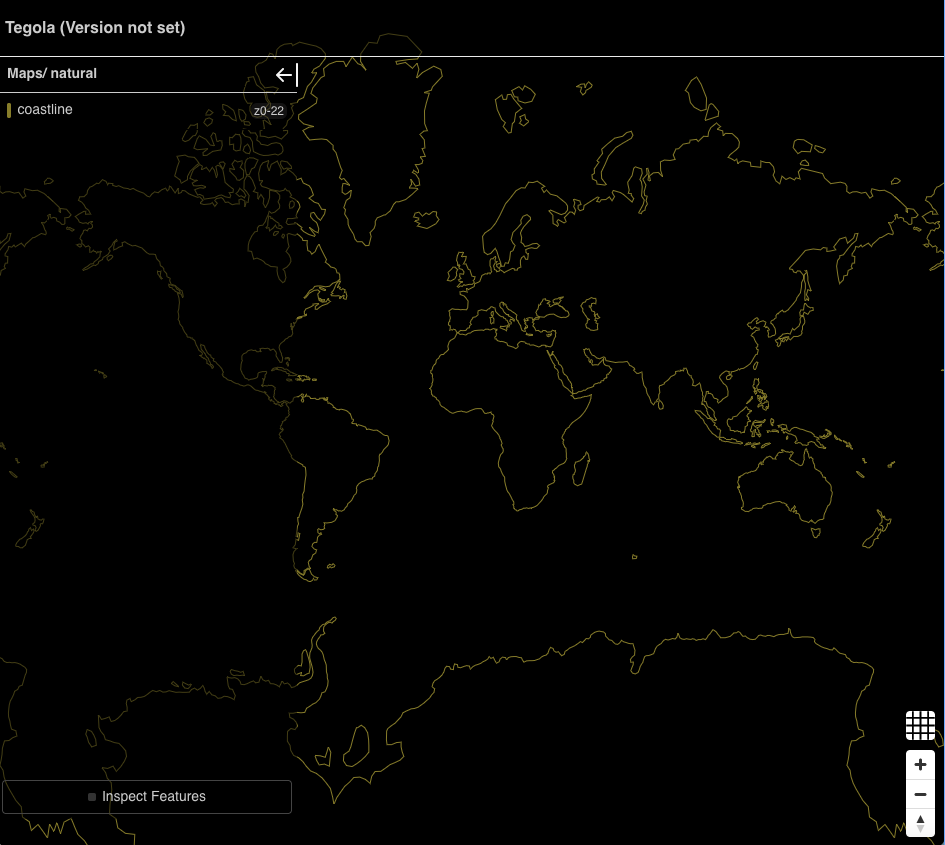
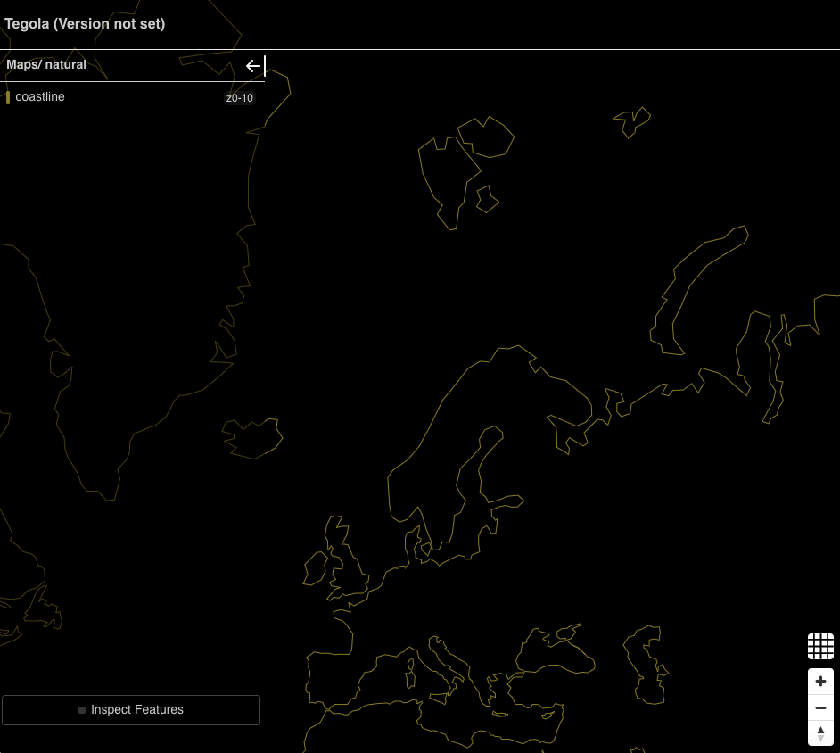
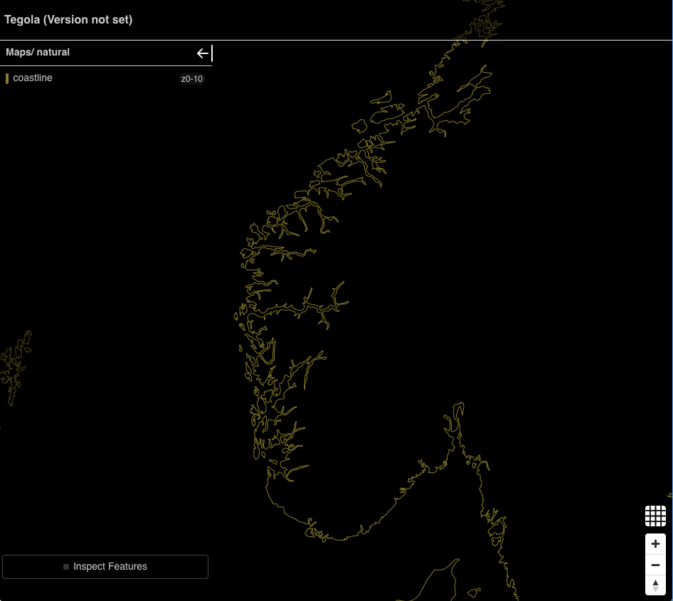

# dhall-tegola-natural-earth

A guide to using [Dhall](https://dhall-lang.org/) and [Tegola](https://tegola.io) to
serve maps.

## 1. Install tegola

TODO: currently missing some features to make this work

## 2. Download Natural Earth Geo Package

You can download find the file here: https://www.naturalearthdata.com/downloads/
Or run the following commands:
```
$ curl -LO http://naciscdn.org/naturalearth/packages/natural_earth_vector.gpkg.zip
$ unzip -c natural_earth_vector.gpkg.zip packages/natural_earth_vector.gpkg > ne.gpkg
```

## 3. Our first map

You can now run the final product:

```
cat ne.dhall | dhall-to-toml | ./tegola serve --config "-"
```

You can find Tegola's documentation [here](https://tegola.io) or take a look
at the `Tegola` definition in  `tegola.dhall`. In short, the configuration is
split into two parts providers and maps. A provider is a backend database
like PostGIS or, in our case, a Geo Package. You can define multiple providers
and they don't have to use the same backend. The provider has layers which
generally correspond to tables in the database (ex.
`antarctic_ice_shelves_polys` in the Natural Earth dataset). A map defines
how Tegola is going to serve the data from the providers. A map also has
layers and they reference one or more provider layers.

Here's an example:
```toml
# ./coastline.toml

# create a provider named ne that points to the natural earth geopkg
[[providers]]
  name = "ne"
  type = "gpkg"
  filepath = "./ne.gpkg"

  # tell tegola there's a table called ne_110m_coastline in the geopkg and
  # that it can be referenced with the name "coastline" in the map layers
  [[providers.layers]]
    name = "coastline"
    tablename = "ne_110m_coastline"

# create a map named natural
[[maps]]
  name = "natural"

  # the map has one layer named coastline which is exposed to the outside
  # world. The layer consists only of data from the coastline layer of the
  # ne provider (note the dot syntax).
  [[maps.layers]]
    name = "coastline"
    provider_layer = "ne.coastline"
```

Now, if you run `tegola serve --config ./coastline.toml` and navigate to
`localhost:8080` on your browser you should see this:



I mentioned that a map layer can use one **or more** provider layers. This is
to enable common and sometimes critical optimization. For exmaple, the natural
earth dataset provides geometries at 10, 50, and 110 meter scales. Lower scale
means more detail, but crucially, larger geometries.

The configuration above only serves the 110 meter coastlines which looks fine
at first, but if you zoom in you'll start *noticing* jagged edges. You could,
instead, serve the 10 meter scale coastlines. However, it is noticeably slower
and the rendered image is noisy. You can try it by changing the `tablename`
of the provider layer:

```diff
-    tablename = "ne_110m_coastline"
+    tablename = "ne_10m_coastline"
```

The solution is to serve the larger scale geometries at lower zooms and
smaller scale geometries at higher zooms. And while this tutorial doesn't
(yet?) cover styling, it would be ideal to hide this optimization from the
front end; that is, the client should just ask for coastlines and Tegola
should be able to choose the ideal scale. This is where the map `min_zoom`
and `max_zoom` come into play:

```toml
# ./coastline-optimized.toml

# create a provider named ne that points to the natural earth geopkg
[[providers]]
  name = "ne"
  type = "gpkg"
  filepath = "./ne.gpkg"

  # the 110m layer we used previously
  [[providers.layers]]
    # it's conventional to use the table name as the provider layer name
    # but not necessary
    name = "ne_110m_coastline"
    tablename = "ne_110m_coastline"

  # the 50m layer for medium zooms
  [[providers.layers]]
    name = "ne_50m_coastline"
    tablename = "ne_50m_coastline"

  # the 10m layer for high zooms
  [[providers.layers]]
    name = "ne_10m_coastline"
    tablename = "ne_10m_coastline"

# create a map named natural
[[maps]]
  name = "natural"

  # here we assign three different provider layers to the coastline map layer
  #
  # a client can style the coastline layer without having to concern itself
  # with this optimization

  # the 110 meter geometries will only be returned for tiles in zooms between
  # 0 and 2, inclusive
  [[maps.layers]]
    name = "coastline"
    min_zoom = 0
    max_zoom = 2
    provider_layer = "ne.ne_110m_coastline"

  # the 50 meter geometries will only be returned for tiles in zooms between
  # 3 and 4, inclusive
  [[maps.layers]]
    name = "coastline"
    min_zoom = 3
    max_zoom = 4
    provider_layer = "ne.ne_50m_coastline"

  # the 10 meter geometries will only be returned for tiles in zooms between
  # 5 and 10, inclusive. Note that clients can still show the geometry at
  # zooms higher than 10 by scaling the level 10 geometries.
  [[maps.layers]]
    name = "coastline"
    min_zoom = 5
    max_zoom = 10
    provider_layer = "ne.ne_10m_coastline"
```

If you re-run `tegola serve --config ./coastline-optimized.toml` and refresh
the viewer, you might not notice that nothing has changed! At the lower zoom
levels this expected. However once you zoom in, you should see more detail
come up. Let's take a look at some Nordic fjords:





## 4. Make some abstractions

At this point, you may have realized this is overly verbose. There's a one-to-one
mapping between provider layers and map layer definitions; that is for
every `providers.layers` in our TOML file there's a corresponding `maps.layers`.
What if we could set a provider and map layer at the same time. Also, we have
to write these two definitions for each zoom we want to use. What if in our
unified definition we could just have list of zooms?

Dhall to the rescue! We can define a single type that has the necessary information to
create a provider layer and a map layer. Part of that information is the multiple zooms.

```dhall
-- this record associates a scale (ex. 10m, 50m, 110m) with a specifc
-- zoom range
let Zoom =
	{ scale : Text
	, min_zoom : Natural
	, max_zoom : Natural
	}
-- the unified layer definition
let Layer =
	-- name is the map layer name, note that the tablename is a predictable
	-- combination of the zoom scale and the name
	{ name : Text
	-- zoom is a list of the desired scale-zoom mappings
	, zoom : List Zoom
	}
```

Now we need to convert our special `Layer` type into `tegola.dhall`'s
`GeoPkgLayer` and `MapLayer` types. We can use Dhall functions. First, note
that a single `Layer` actually creates multiple `GeoPkgLayer`s and `MapLayer`s
because `Layer` contains multiple zooms. So, the functions should have a
signature `Layer -> List GeoPkgLayer` and `Layer -> MapLayer`. Let's focus
on `GeoPkgLayer first`. `GeoPkgLayer` is an enum and we're working with the
`Table` alternative (we're not writing our own sql):

```dhall
let GeoPkgLayer =
	< Table :
		{ name : Text
		, tablename : Text
		, fields : Optional (List Text)
		, id_fieldname : Optional Text
		}
	| SQL :
		{ name : Text
		, sql : Text
		, id_fieldname : Optional Text
		}
	>
```

We can ignore `fields` and `id_fieldname`, providing the appropriate `None`
value. And to keep things easy, `name` and `tablename` will be the same.
I noted above that the tablename is generally predictable, in the Natural
Earth data set, tebles are named `ne_${scale}_${name}` where `name` is
something like "coastline". Here's the function I came up with:

```dhall
let mkGeoPkgLayer : Layer.Type -> List T.GeoPkgLayer = \(l : Layer) ->
	Prelude.List.map
		Zoom
		T.GeoPkgLayer
		(\(d : Zoom) -> T.GeoPkgLayer.Table
			{ name = "ne_${d.scale}_${l.name}"
			, tablename = "ne_${d.scale}_${l.name}"
			, fields = None (List Text)
			, id_fieldname = None Text
			})
		l.zoom
```

Given a `l : Layer` we iterate `l.zooms` and generate a `GeoPkgLayer` from
each `Zoom`. Generating, `MapLayer`s is pretty similar:

```dhall
let mkMapLayer : Layer.Type -> List T.MapLayer.Type = \(l : Layer) ->
	Prelude.List.map
		Zoom
		T.MapLayer.Type
		(\(d : Zoom) -> T.MapLayer::
			{ name = Some l.name
			, provider_layer = "ne.ne_${d.scale}_${l.name}"
			, min_zoom = Some d.min_zoom
			, max_zoom = Some d.max_zoom
			})
		l.zoom
```

Now that we have these conversion functions we can create a `List Layer`.

```dhall
let zoom110 =
	{ scale = "110m"
	, min_zoom = 0
	, max_zoom = 2
	}

let zoom50 =
	{ scale = "50m"
	, min_zoom = 3
	, max_zoom = 4
	}

let zoom10 =
	{ scale = "10m"
	, min_zoom = 5
	, max_zoom = 10
	}

let layers : List Layer.Type =
	[
		{ name = "coastline"
		, zoom = [ zoom10, zoom50, zoom110 ]
		} : Layer
	]
```

While we only have one layer, putting the zooms in variables makes it easy to
reuse these values as defaults when more layers are added. The last step is
to create the `List GeoPkgLayer` and `List MapLayer` needed for the `Tegola`
record. This a bit tricky since our conversion functions return lists, but
`Prelude.List.concat` takes care of that for us:

```dhall
Prelude.List.concat
	T.GeoPkgLayer
	(Prelude.List.map
		Layer
		(List T.MapLayer.Type)
		mkMapLayer
		layers)
```

The function for `MapLayer` is almost indentical. You check the complete file
in `./coastline-optimized-dhall.dhall` and run it using:

```
$ cat coastline-optimized-dhall.dhall | dhall-to-toml | tegola serve --config -
```

With this framework, adding layers is quite easy, all it takes is adding
elements to the `layers` list. Here's what it looks like to add countries
and country lable points. Though, what I showed in the tutorial does not
have support for plumbing the text for the label, that requires using
the `fields` field of `GeoPkgLayer` :

```dhall
let layers : List Layer =
	[
		{ name = "coastline"
		, zoom = [ zoom10, zoom50, zoom110 ]
		} : Layer
	,
		{ name = "admin_0_countries"
		, zoom = [ zoom10, zoom50, zoom110 ]
		} : Layer
	,
		{ name = "admin_0_label_points"
		-- using Dhall's // operator we can override the default values we
		-- set for ourselves
		, zoom = [ zoom10 // { min_zoom = 0 } ]
		}
	]
```

## Conclusion

The generated TOML from this example is shorter than the source Dhall file.
However, that is not always true. I implemented a configuration similar to
[one in a go-spatial repo](https://github.com/go-spatial/tegola-osm/blob/master/tegola-natural-earth.toml),
the `./ne.dhall` file, and the Dhall file was about half the size. It is
also easier to navigate, and the patterns for generating related definitions
can be expressed explicitly through the Dhall language, making it easier
to maintain.

